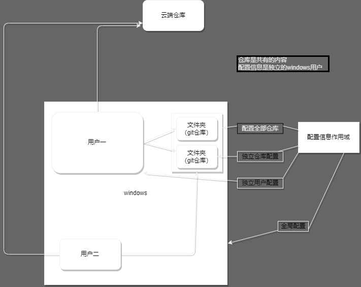

# **git使用流程**

git基础使用和速查手册

## 常用流程

### 第一次配置

```c
//下载安装，远程仓库注册
//安全连接（ssh/令牌）							   //具体查看百度
$ git init										//初始化git
$ git remote add [git_name] [cloud_path]		//添加远程仓库
$ git clone [cloud_path]						//克隆远程仓库到本地 
```

### 取消跟踪

```c
//add . 忽略列表：在.git水平目录下建立文件 .gitgnore 一行一个名称正则
//				 仅对add . 有效 目的是忽略这个文件的添加
$ git rm			//在git跟踪目录中删除即为取消跟踪
$ git rm -cached [file_name]		//仅取消跟踪，文件后续不再相关
$ git rm -f 	 [file_name]		//取消跟踪加删除文件
```


## 取仓库

### 本地账户配置

```c
$ git config --global user.name "[user_name]"
$ git config --global user.email [email]
```

### 查看配置信息

```c
$ git congif --list		//本地配置信息
$ git config user.[user_name]	//name用户配置信息
```

### 取文件

```c
$ git checkout .		//从暂存区取代码并覆盖工作区(未add的文件危险)
$ git checkout HEAD		//从本地仓库取代码并覆盖工作区(未commit的文件危险)
$ git clone [could_path] [local_path]	//远程仓库clone 存放目录可以是（绝/相）对路径
$ git pull [git_name] [could_branch]:[local_branch]		//合并远程代码到工作区
```

### 远程相关

```C
$ git remote			//远程仓库的操作
$ git remote -v			//查看当前仓库的与远程仓库的链接情况
$ git remote show [could_path]				//查看远程仓库的信息
$ git remote add [git_name] [could_path]	//连接远程仓库
$ git remote rm [git_name]					//解除链接远程仓库
$ git remote rename [git_name] [new_git_name]	//重命名仓库
```

```c
$ git fetch				//取远程仓库	安全的获取远程仓库代码
$ git fetch	[git_name]					//取代码到本地仓库但是不展现在工作区(更安全)
$ git fetch [git_name] [could_branch]	//取代码(某一分支的)但是不合并
$ git fetch --all						//所有远程仓库的所有分支
$ git fetch --dry-run					//测试但不做任何变更，会输出相关代码提示
```

```C
$ git pull				//拿加合并远程仓库代码
$ git pull [git_name]	//直接合并远程仓库（可能会需要处理冲突）（一般来讲是多工作地点 同步最新）
$ git pull [git_name] [could_branch]:[local_branch]		//与上一条一样但是之定义分支
```

```C
$ git push				//直接上传到远程仓库并合并	如果当前分支只有一个远程分支，最简形式
$ git push [git_name]	//如果当前分支与远程分支存在追踪关系，则本地分支和远程分支都可以省略
$ git push [git_name] [local_branch]	//推送本地分支名合并到远程分支上（没有分支就新建）
$ git push [git_name] [local_branch]:[could_branch]		//上传合并（local很重要）
$ git push --force [git_name] [local_branch]			//强制上传
$ git push [git_name] --delete [local_branch]			//给master推送一个空内容（即删除）
    
$ git push -u [git_name] [local_branch]		//设定默认推送分支，之后可以用 git push
```

### HEAD

> HEAD是一个指向活跃分支节点的指针，通过check可以修改分支

### 分支相关

```C
$ git branch 		//列出本地分支
$ git branch [new_local_branch]		//新建本地分支
$ git checkout [local_branch]		//切换活动分支，并将工作区设为local_beanch的最新节点
$ git checkout -b [new_local_branch]//新建本地分支并切换
$ git checkout -d [local_branch]	//删除本地分支
```

### 合并相关

```C
$ git merge			//解决冲突
$ git merge [local_branch]		//将local_branch 合并到当前分支中 完成/有冲突
$ git merge --abort				//退出这次合并，并且恢复到当前分支在进行合并之前的状态
$ git status					//查看状态，可能有利于解决冲突
$ git log --merge				//列出冲突分支
$ git diff						//找到仓库或者文件在不同状态之间的异同,预测冲突
$ cat merge.txt					//直接查看冲突行内容
$ vim merge.txt					//任何软件都行，只要把需要留下的留在行中就可以了
$ git add merge.txt				//合并冲突后添加再提交就算完结了
$ git commit -m "XXX冲突解决"  	 //冲突解决后需要commit一次，所有提交信息按规定格式就好
```

### 版本回溯

```
$ git log			//查看历史提交
$ git log --oneline //简略形式查看历史记录
$ git blame [file_name]			//指定文件的修改记录
```

### 版本发布（标签）

```
$ git tag 							//查看所有标签
$ git tag    [tag_name]				//简单标签
$ git tag -a [tag_name] -m "[tag_note]"		//打标签并附[tag_note]
$ git tag -a [tag_name] [key]		//为特定提交打标签
$ git tag -d [tag_name]				//删除标签

```


## 图像原理



使用流程


